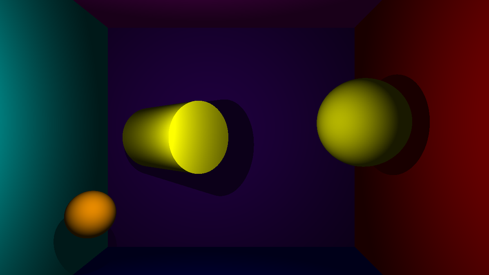
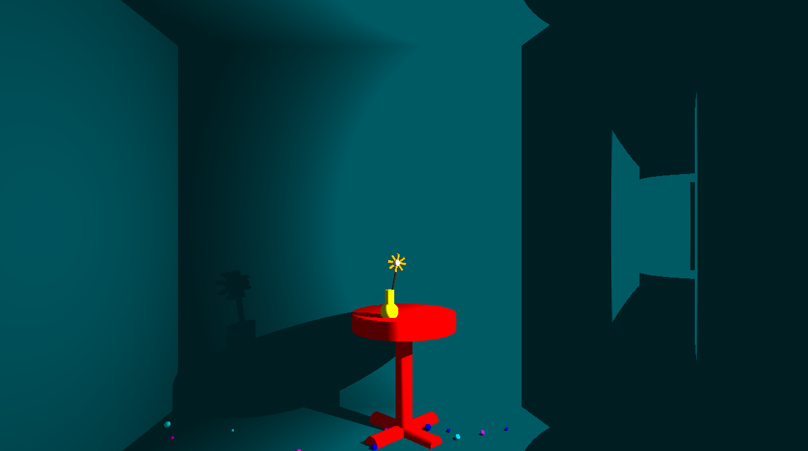
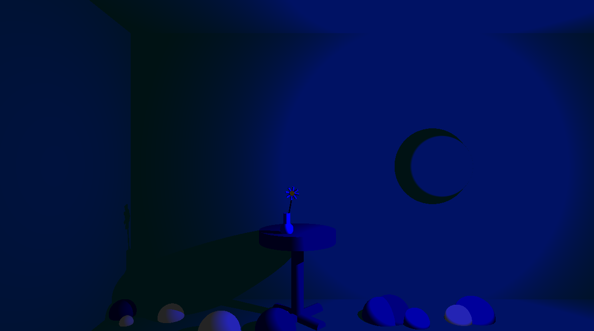

# MiniRT

## Overview

MiniRT is a minimalistic ray tracing engine built as part of the 42 Paris curriculum. It renders 3D scenes using the ray tracing technique, allowing for lighting and shadows effects. This project aims to help students develop their skills in programming, mathematics, and algorithmics, particularly in computer graphics.

The code is not provided as it's the rule of 42Seoul.

<div align="center">
  
</div>

## Usage

1. Create a scene description in a .rt file following this file format:
```
A [ambient_intensity] [ambient_color]
C [camera_position] [camera_direction] [FOV]
L [light_position] [light_intensity] [light_color]
sp [sphere_center] [sphere_diameter] [sphere_color]
pl [plane_point] [plane_normal] [plane_color]
cy [cylinder_center] [cylinder_direction] [cylinder_diameter] [cylinder_height] [cylinder_color]
```
Note that capital letters can only be placed once. <br>
Alternatively, maps examples can be found in the *maps* folder.

2. Run the executable as follow:
```bash
./miniRT [map_file]
```

## Screenshots

<div align="center">
  
  
  
</div>

## Acknowledgments

A heartfelt thanks to [Oriane Lelong](https://github.com/olelong), for her collaboration, innovative ideas and the countless hours spent debugging, optimizing, and refining MiniRT together.
